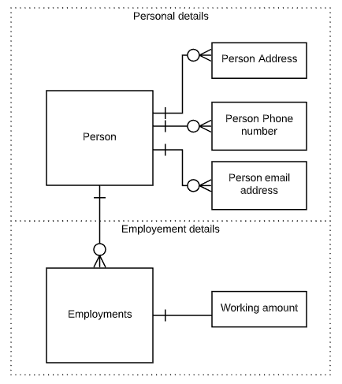

## Learning Employees
[Object attributes]()  
[Data mapping]()  
[API endpoints]()  
[API example]()  
  
The object employee contains all personal and employment details of an employee.

### Object attributes
An employee is a person with one or more employments.
  

